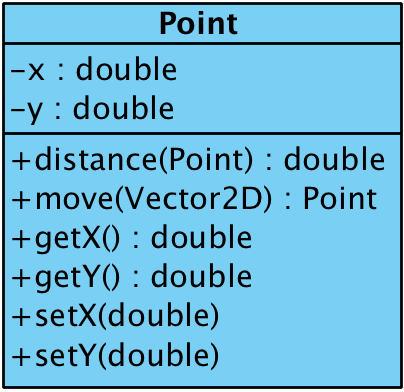
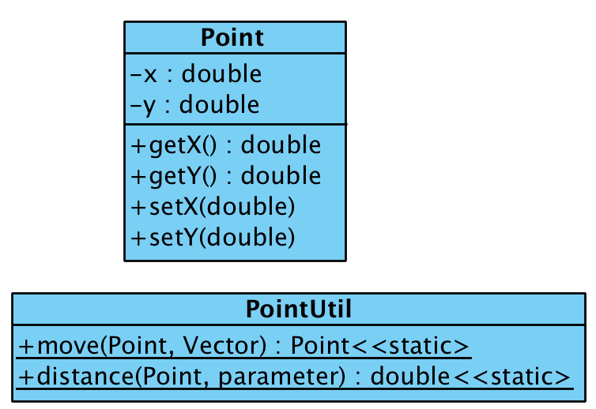
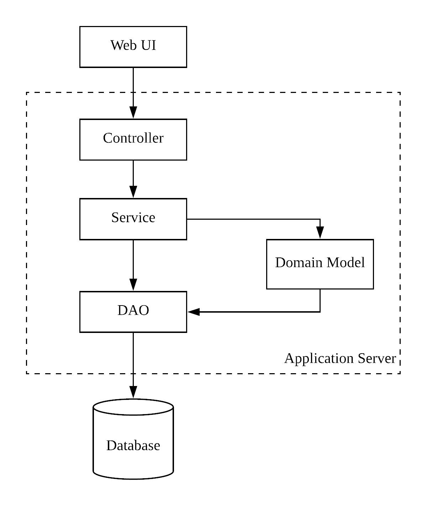
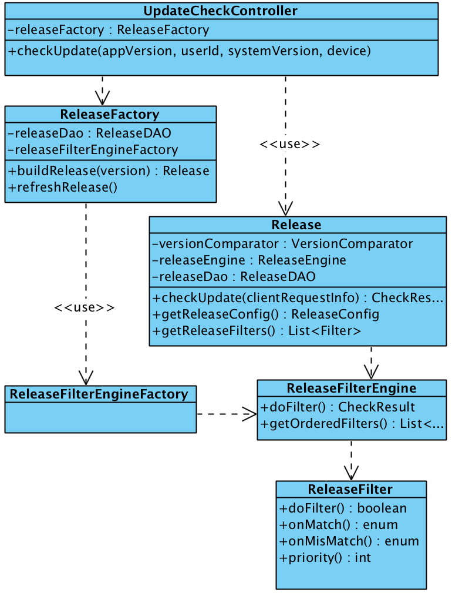

* content
{:toc}

## 前言
领域驱动设计（Domain-Driven Design）是非常优秀的设计思想，也解答了我从开始接触Java编程就一直有的疑惑，“这种方式就是面向对象编程么，和书上讲的不太一样？”，也让我明白了真正的面向对象应该是什么样子的，基于这种思想也已经实践了几个项目，感觉好处多多，今天将最近的想法和大家分享一下。

## 面向对象

面向对象变成(OOP)是一个非常古老的话题，绝大部分同学第一节Java课都会听到。面向对象编程的核心就是类和对象，现在回忆一下它们的概念: 类是从现实世界中对物品进行抽象出的模型，它具有状态和行为，都对应着真实世界，对象是以类为原型创建出来的。

举个例子，我们为二维世界的点抽象出一个类Point，Point类的特征则是位置，通过坐标确定。Point至少需要包含X轴坐标值和Y轴坐标值。那么除了获取和设置坐标值以外，还应该包含一些其他行为，比如移动一个向量值，或者计算这个点距离另外一个点的距离。

我认为上述的抽象是正确的。但是见过的代码里面，比较常见的方式则是这样的。

属性和之前的方式一样，但是行为交给了一个工具类的静态方法处理。无法抽象出正确的类，没有赋予类正确的行为，Point这个类其实已经退化成了C语言中的结构体。

这样做有什么缺点呢？行为没有正确的归属。原本应该属于Point的行为被随便塞给了一个无关对象。试想，一个大型系统中会有非常多的类，相应的也会有大量的行为。当大量的行为没有正确的归属的时候，就如同超市里面的商品胡乱摆放：我以为酱油应该属于调味品，没想到在床上用品区域才找到。这样做给人的感觉就是，乱乱乱！！！

很多人都见过Service层一个方法有上千行的方法，甚至上万行的类，维护过这种代码的同学更明白那是一种什么感觉。

很多有良好代码习惯的同学会将大的方法拆解为小方法，然后发现一个类的方法太多了，接着将大的Service拆成多个小的Service，然而随着业务的发展、需求的变化，行为进一步复杂了，那么就需要一直不断重复这种过程。但是即使做，恐怕也没办法让人对代码有一个清晰的感觉。

## 错误的面向对象

代码满足以下描述，很大的可能性，面向对象的姿势并不对。

1. 大部分业务代码存在于`Controller`或者`Service`层，这种现象叫做胖服务层(Fat Service Classes)；
2. 手动通过new创建出来的对象，只包含属性和getter/setter方法；
3. 大部分业务代码位在于Spring管理的Bean中；
4. 存在大量类的命名类似于`*Manager`，`*Util`

如果基本满足以上特点，建议再了解一下，事务脚本和贫血模型这两个概念，贫血模型和事务脚本是常见的违背面向对象编程思想的方式。

## 回归正确道路

面向对象的实践，需要重点注意以下几点：
1. 为现实世界的模型进行正确的抽象，控制粒度，并赋予类应有的行为；
2. 精简的服务层，相关行为应交还给对应的领域对象，服务层应只负责组合领域对象的行为，完成相应的业务；
3. 不要滥用工具类和静态方法

结构如下图，相对传统结构增加领域层：

Service层和领域模型层对DAO层都有直接调用，如何进行分离，可以参考命令查询职责分离（CQRS）模式.

## 基于Spring框架的实践

从历史原因上讲，Java不正确的面向对象的开发方式之所以如此流行，和EJB/Spring这两大框架的盛行是分不开的，尤其是Spring的流行， 更是将这种现象推向了顶峰，也使得当前Java一直在错误的道路上越走越远。

Spring本身来讲，它设计的并没有摆脱事务脚本的思路。使用Spring的依赖注入，可以做到将对一个类的实例的方法的调用，变的类似于静态类方法的调用，而静态类本身的思想更是面向过程的。

Spring本身并没有错，但我们需要放弃的使用方式。既能利用面向对象的优势，又能继续享受Spring带来的便利，处理方式也是出人意料的简单，手动new、工厂模式：

1. 手动创建领域对象 ，不使用Spring的注入，在领域对象不依赖其他Spring管理的Bean时比较方便；
2. 工厂模式，工厂类的对象交给Spring管理，领域对象由工厂创建。

举个例子，最近编写了一套灰度发布系统，核心逻辑是根据各种维度，判断是否需要提示客户升级到灰度包。维度包括租户、用户、部门、群组、发布比例、客户设备类型、版本等。实际类图比较复杂，核心逻辑简化如下：

UpdateCheckController/ReleaseFactory/ReleaseFilterEngineFactory继续作为Bean由Spring管理，Release对象则由ReleaseFactory负责创建，创建时通过构造函数，传入Spring管理的Bean: ReleaseFilterEngineFactory和ReleaseDAO. 这样发布的逻辑集中由Release处理，包括版本对比，灰度发布过滤器也交给对应的类处理。

这样既可以将行为归属于正确的领域对象，避免事务脚本式编程，也可以继续享受Spring框架的好处。除此之外，还可以在工厂类上做一些优化，如使用动态工厂，蝇量模式等设计模式，做进一步优化。

## 结语
面向对象编程是领域驱动设计的基础，企业级级系统由于其本身最大的特点，业务复杂！并且由于企业互联网的盛行，响应客户需求的速度也在逐步加快，领域驱动设计在处理这些问题有着巨大的优势，为了早日享受到的领域模型的好处， 我们开发也应该为了这一目标早做准备。第一步，做好正确的类抽象，用正确的姿势面向对象。
